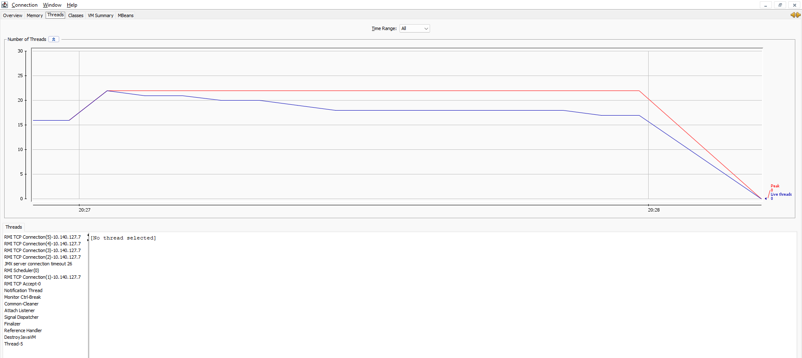

# TP1 - Thread, Runnable, join
## GIBOZ Alexandre, INFO2 2023-2025
***

[Énoncé](https://igm.univ-mlv.fr/coursconcurrenceinfo2/tds/td01.html)
***

## Exercice 1 - Hello Thread

1. **Rappeler à quoi sert un Runnable.**

Runnable est une interface qui permet d'exécuter du code sans prendre de paramètres et sans retourner de valeur. 
Etant donné qu'un thread ne prend pas de paramètres et ne retourne rien, Runnable semble adapté au cas des threads.

2. **Écrire, dans un premier temps, une classe HelloThread qui crée et démarre 4 threads (et faire en sorte qu'on puisse facilement en demander 150) qui affichent les nombres de 0 à 5 000 (sans le numéro unique par thread, donc).**

Voici le code de la classe HelloThread :
```java
import java.util.stream.IntStream;

public final class HelloThread {
  private final int nbThread;

  public HelloThread(int nbThread) {
    if (nbThread < 0) {
      throw new IllegalArgumentException("nbThread must be positive");
    }
    this.nbThread = nbThread;
  }

  public void run() {
    IntStream.range(0, nbThread).forEach(i -> {
      Runnable runnable = () -> {
        for(int j = 0; j <= 5000; j++) {
          System.out.println("hello " + j);
        }
      };
      Thread thread = Thread.ofPlatform().start(runnable);
    });
  }

  public static void main(String[] args) {
    var threads = new HelloThread(4);
    threads.run();
  }
}
```

3. **Exécutez le programme plusieurs fois, que remarque-t-on ? Puis, en regardant l'affichage (scroller au besoin), qu'y a-t-il de bizarre ? Est-ce que tout ceci est bien normal ?**

Les nombres n'apparaissent pas forcément dans le bon ordre. Cela est du au fait qu'il y a un entrelacement des threads dans l'affichage, ces derniers n'étant pas
au même niveau d'exécution au même moment. L'affichage du numéro de thread permettrait d'y voir plus clair.

4. **Modifiez votre code pour afficher en plus le numéro de chaque thread (sans utiliser le numéro du thread, juste la variable de boucle).**

Code complet de la classe HelloThread :
```java
import java.util.stream.IntStream;

public final class HelloThread {
  private final int nbThread;

  public HelloThread(int nbThread) {
    if (nbThread < 0) {
      throw new IllegalArgumentException("nbThread must be positive");
    }
    this.nbThread = nbThread;
  }

  public void run() {
    IntStream.range(0, nbThread).forEach(i -> {
      Runnable runnable = () -> {
        for(int j = 0; j <= 5000; j++) {
          System.out.println("hello " + i + " " + j);
        }
      };
      Thread thread = Thread.ofPlatform().start(runnable);
    });
  }

  public static void main(String[] args) {
    var threads = new HelloThread(4);
    threads.run();
  }
}
```

<br>

## Exercice 2 - This is the end, my friend ...

1. **Recopiez le programme de l'exercice précédent dans une nouvelle classe HelloThreadJoin puis modifiez le pour que soit affiché le message "le programme est fini" lorsque tous les threads ont fini leurs calculs.**

Code de la classe HelloThreadJoin :
```java
import java.util.ArrayList;
import java.util.stream.IntStream;

public final class HelloThreadJoin {
  private final int nbThread;
  private final ArrayList<Thread> threads = new ArrayList<>();

  public HelloThreadJoin(int nbThread) {
    if (nbThread < 0) {
      throw new IllegalArgumentException("nbThread must be positive");
    }

    this.nbThread = nbThread;
  }

  public void run() {
    IntStream.range(0, nbThread).forEach(i -> {
      Runnable runnable = () -> {
        for(int j = 0; j <= 5000; j++) {
          System.out.println("hello " + i + " " + j);
        }
      };
      Thread thread = Thread.ofPlatform().start(runnable);
      threads.add(thread);
    });
    threads.forEach(thread -> {
      try {
        thread.join();
      } catch (InterruptedException e) {
        throw new AssertionError(e);
      }
    }
    );
    System.out.println("Le thread a fini son Runnable");
  }

  public static void main(String[] args) {
    var threads = new HelloThreadJoin(4);
    threads.run();
  }
}
```

<br>

## Exercice 3 - JConsole

1. **Réaliser la classe TurtleRace. Bien entendu, votre code doit fonctionner si l'on modifie le tableau times.**

Le code de la classe TurtleRace :
```java
import java.util.stream.IntStream;

public final class TurtleRace {
  public static void main(String[] args) {
    System.out.println("On your mark!");

    try {
      Thread.sleep(15_000);
    } catch (InterruptedException e) {
      throw new AssertionError(e);
    }

    System.out.println("Go!");
    int[] times = {25_000, 10_000, 20_000, 5_000, 50_000, 60_000};

    IntStream.range(0, times.length).forEach(i -> {
      Thread.ofPlatform().start(() -> {
        try {
          Thread.sleep(times[i]);
        } catch (InterruptedException e) {
          throw new AssertionError(e);
        }
        System.out.println("Turtle " + i + " has finished !");
      });
    });
  }
}
```

3. **Juste après avoir lancé la classe TurtleRace, lancez jconsole dans un terminal.**

On obtient l'affichage suivant :


3. **Observer l'évolution du nombre de threads. 
    Que devient le thread main ? Quand est-ce que la JVM s'éteint ?**

Le thread main est terminé bien avant les autres threads. On constate qu'il n'apparait rapidement plus dans la liste
des threads listés par la Jconsole:


Ce comportement est du au fait que le thread main ne fait que lancer les autres threads, et ne fait pas de calculs ou de sleep. Ce thread est donc terminé 
bien avant les autres. La JVM ne s'éteint qu'une fois que chaque thread est mort, et non une fois que le main est mort.

4. **Que se passerait-il si les threads "Turtle" étaient daemon ?**

Si les threads "Turtle" étaient daemon, ils seraient terminés dès que le thread main terminerait sa toute dernière instruction. La JVM s'éteindrait donc dès que le thread main est terminé, et bien avant
que le sleep respectif de chaque thread soit écoulé.

<br>

## Exercice 4 - La magie de System.out.println

2. **Expliquer le comportement observé.**

Étant donné que l'affichage se fait caractère par caractère, il est possible qu'un thread soit interrompu entre l'affichage de deux caractères par l'affichage d'un autre. Ce comportement 
se remarque bien plus lorsqu'il s'agit d'un affichage caractère par caractère, et non ligne par ligne.

3. **Pourquoi ce comportement n’apparaît-il pas quand on utilise System.out.println ?**

System.out.println appelle la méthode privée "write" de la classe PrintStream:
```java
private void write(String s) {
  try {
    if (lock != null) {
      lock.lock();
      try {
        implWrite(s);
      } finally {
        lock.unlock();
      }
    } else {
      synchronized (this) {
        implWrite(s);
      }
    }
  }
  catch (InterruptedIOException x) {
    Thread.currentThread().interrupt();
  }
  catch (IOException x) {
    trouble = true;
  }
}
```

Cette dernière utilise un "lock", ce qui permet d'éviter l'entrelacement des threads lors de l'affichage.